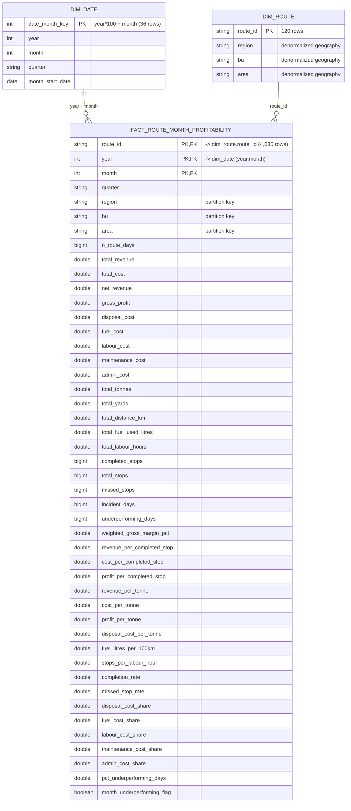

# Dimensional Model — ERD

Flat **star schema** for the Route Profitability dashboard (sliceable by date,
region, BU, area). One fact at **route-month** grain, two conformed dimensions, no
surrogate keys, no SCD2 (the geography hierarchy is static and the fact is
append-mostly). DDL: [../sql/dimensional_model_ddl.sql](../sql/dimensional_model_ddl.sql).

## Notes

- **Grain:** one row per `route_id × year × month` — **4,035** rows (routes don't all
  run every month, so < 120×36).
- **Keys:** natural keys only. Fact PK = `(route_id, year, month)`; `route_id` →
  `dim_route`, `(year, month)` → `dim_date` via `date_month_key = year*100 + month`.
- **Relationships are logical** (enforced in the BI tool, not by Delta — Delta does
  not enforce PK/FK constraints).
- **Partitioning** of the fact by `region, bu, area` matches the dashboard's primary
  slice keys so filters prune files. Geography is duplicated onto `dim_route` (the
  flat-star denormalization) so a single `fact → dim_route` join answers any slice.
- Counts (4,035 / 120 / 36) and column list are the live schema from notebook 03;
  the DDL is generated from these same Delta tables and verified column-for-column.
